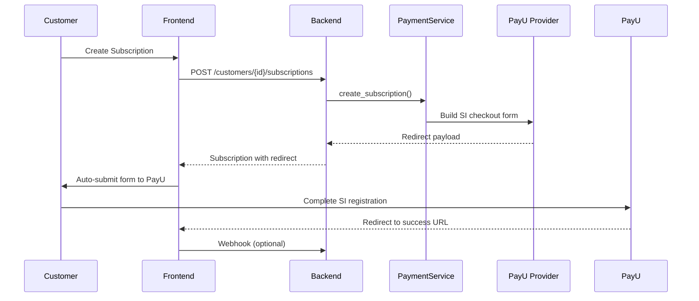
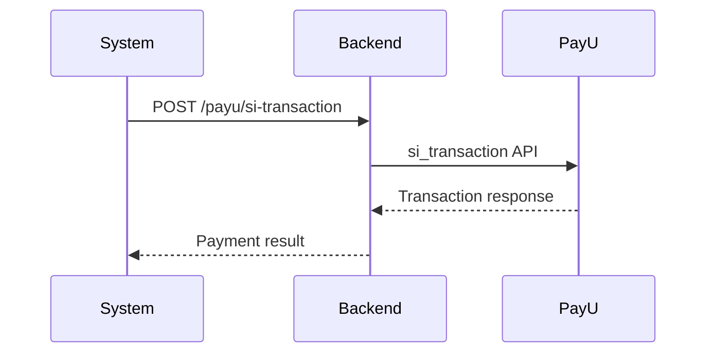

# PayU Subscriptions (Standing Instructions) Guide

This guide explains how to use PayU recurring payments (Standing Instructions/SI) in the fastapi-payments-example application.

## Overview

PayU subscriptions use the Standing Instruction (SI) framework, which allows merchants to:
- Register recurring payment mandates with customers
- Execute recurring transactions automatically
- Manage (modify/cancel) existing mandates
- Comply with RBI guidelines for pre-debit notifications

## Prerequisites

1. **PayU Account**: You need a PayU merchant account with SI enabled
2. **Configuration**: Set up PayU credentials in your `.env` file:

```bash
PAYU_API_KEY=your_merchant_key
PAYU_API_SECRET=your_merchant_salt
PAYU_SANDBOX_MODE=true

# Optional: Override default callback URLs
PAYU_SUCCESS_URL=http://localhost:3000/payu/success
PAYU_FAILURE_URL=http://localhost:3000/payu/failure
PAYU_CANCEL_URL=http://localhost:3000/payu/cancel
```

## How PayU Subscriptions Work

### 1. SI Registration Flow

When you create a subscription with PayU:



### 2. Recurring Transaction Flow

After SI registration, execute recurring payments:



## API Usage

### Creating a Subscription

**Backend API**:
```http
POST /customers/{customer_id}/subscriptions
Content-Type: application/json

{
  "plan_id": "plan_123",
  "quantity": 1,
  "provider": "payu",
  "metadata": {
    "amount": 999.00,
    "customer_context": {
      "name": "John Doe",
      "email": "john@example.com",
      "phone": "9876543210"
    },
    "payu": {
      "firstname": "John Doe",
      "email": "john@example.com",
      "phone": "9876543210",
      "productinfo": "Premium Subscription",
      "si_start_date": "01-02-2025",
      "si_period": "monthly",
      "si_cycles": "12",
      "si_end_date": "01-02-2026",
      "surl": "http://localhost:3000/payu/success",
      "furl": "http://localhost:3000/payu/failure",
      "curl": "http://localhost:3000/payu/cancel"
    }
  }
}
```

**Response**:
```json
{
  "id": "sub_abc123",
  "customer_id": "cust_xyz",
  "plan_id": "plan_123",
  "status": "pending",
  "metadata": {
    "redirect": {
      "action_url": "https://test.payu.in/_payment",
      "method": "POST",
      "fields": {
        "key": "merchant_key",
        "txnid": "txn_123",
        "amount": "999.00",
        "si": "1",
        "si_start_date": "01-02-2025",
        "si_period": "monthly",
        "hash": "..."
      }
    }
  }
}
```

### Frontend Integration

The `SubscriptionForm` component handles PayU subscriptions automatically:

```tsx
<SubscriptionForm 
  customerId={customerId} 
  provider="payu"
  onSuccess={(sub) => {
    // For PayU, user will be redirected to PayU hosted page
    // Success callback happens after redirect back
  }}
/>
```

### PayU-Specific Fields

| Field | Required | Format | Description |
|-------|----------|--------|-------------|
| `si_start_date` | Yes | dd-MM-yyyy | Date to start recurring payments |
| `si_period` | Yes | daily/weekly/monthly/yearly | Billing frequency |
| `si_amount` | Yes | float | Amount per cycle |
| `si_cycles` | No | integer | Number of cycles (unlimited if not set) |
| `si_end_date` | No | dd-MM-yyyy | End date for SI |
| `phone` | Yes | string | Customer phone number |

### Executing Recurring Payments

After SI registration, use the mandate token to execute payments:

```http
POST /payu/si-transaction
Content-Type: application/json

{
  "mandate_token": "mandate_token_from_registration",
  "amount": 999.00,
  "txnid": "optional_transaction_id"
}
```

### Pre-Debit Notifications (RBI Compliance)

Before executing a recurring payment, send a notification:

```http
POST /payu/pre-debit-notify
Content-Type: application/json

{
  "mandate_token": "mandate_token",
  "amount": 999.00,
  "debit_date": "01-03-2025"
}
```

### Canceling a Subscription

```http
POST /subscriptions/{subscription_id}/cancel
```

This will call PayU's `mandate_revoke` API to cancel the standing instruction.

## Frontend Components

### SubscriptionForm Updates

The form now includes:
- Provider selection (Stripe/PayU)
- PayU-specific fields (phone, SI dates, periods)
- Automatic redirect handling for PayU hosted checkout
- Conditional field rendering based on selected provider

### Success Page Enhancement

The success page now:
- Detects subscription completions
- Displays mandate token (for reference)
- Shows subscription-specific success messages
- Provides navigation to subscriptions list

## Testing PayU Subscriptions

### Test Cards (PayU Sandbox)

For SI testing in sandbox mode, use:
- **Visa**: 4508 7509 7509 7509
- **MasterCard**: 5123 4512 3451 2345
- **CVV**: 123
- **Expiry**: Any future date

### Test Flow

1. **Create a Product and Plan**:
```bash
curl -X POST http://localhost:8000/products \
  -H "Content-Type: application/json" \
  -d '{
    "name": "Premium Plan",
    "description": "Monthly subscription"
  }'

curl -X POST http://localhost:8000/products/{product_id}/plans \
  -H "Content-Type: application/json" \
  -d '{
    "name": "Monthly",
    "amount": 999.00,
    "currency": "INR",
    "billing_interval": "month",
    "billing_interval_count": 1
  }'
```

2. **Create a Customer**:
```bash
curl -X POST http://localhost:8000/customers \
  -H "Content-Type: application/json" \
  -d '{
    "email": "test@example.com",
    "name": "Test User"
  }'
```

3. **Create Subscription via Frontend**:
   - Navigate to `/subscriptions/new`
   - Select PayU as provider
   - Fill in SI details
   - Submit form → redirects to PayU
   - Complete payment on PayU
   - Redirects back to success page

4. **Execute Recurring Payment** (after registration):
```bash
curl -X POST http://localhost:8000/payu/si-transaction \
  -H "Content-Type: application/json" \
  -d '{
    "mandate_token": "token_from_registration",
    "amount": 999.00
  }'
```

## Important Notes

### Mandate Token Storage

The mandate token received after successful SI registration should be stored:
- It's returned in the webhook/callback
- Store it in `subscription.metadata['mandate_token']`
- Required for executing recurring payments and cancellations

### Webhook Integration

For production, implement webhook handling:
```python
@app.post("/webhooks/payu")
async def handle_payu_webhook(request: Request):
    payload = await request.form()
    
    # Verify hash
    provider = payment_service.get_provider("payu")
    event = await provider.webhook_handler(dict(payload))
    
    # Handle SI registration success
    if event.get("is_subscription") and event.get("standardized_event_type") == "subscription.created":
        mandate_token = payload.get("mihpayid")
        # Update subscription with mandate token
        
    return {"status": "received"}
```

### Date Format

PayU requires dates in **dd-MM-yyyy** format (e.g., "25-12-2025"), not ISO format.

### Currency

PayU India primarily supports INR. Ensure your plans are in INR for Indian market.

### RBI Guidelines

- Pre-debit notifications are mandatory
- Notifications must be sent 24-72 hours before debit
- Customers must be able to cancel mandates easily

## Differences from Stripe

| Feature | Stripe | PayU SI |
|---------|--------|---------|
| Registration | Client-side setup | Hosted redirect |
| Recurring execution | Automatic | Manual API call |
| Pre-debit notification | N/A | Required (RBI) |
| Mandate management | Automatic | Manual revoke API |
| Trial periods | Native support | Manual implementation |

## Error Handling

Common errors and solutions:

| Error | Cause | Solution |
|-------|-------|----------|
| "si_start_date is required" | Missing SI start date | Provide date in dd-MM-yyyy format |
| "Invalid hash" | Incorrect salt/key | Verify PAYU_API_SECRET |
| "Customer phone required" | Missing phone | Add phone to customer_context |
| "Invalid mandate token" | Wrong/expired token | Get new token via re-registration |

## Production Checklist

- [ ] Set `PAYU_SANDBOX_MODE=false`
- [ ] Use production merchant key and salt
- [ ] Implement webhook verification
- [ ] Store mandate tokens securely
- [ ] Set up pre-debit notification cron
- [ ] Test mandate revoke flow
- [ ] Verify callback URLs are HTTPS
- [ ] Implement proper error handling
- [ ] Add logging for SI transactions
- [ ] Set up monitoring for failed debits

## Resources

- [PayU SI Documentation](https://docs.payu.in/docs/using-api-integration-recurring-payments)
- [PayU API Reference](https://docs.payu.in/reference/recurring_payment_api)
- [RBI Guidelines](https://www.rbi.org.in/) on Standing Instructions

## Support

For issues specific to:
- **PayU Integration**: Contact PayU merchant support
- **Library Issues**: Open issue on [fastapi-payments GitHub](https://github.com/innerkorehq/fastapi-payments)
- **Example App**: Check existing issues or create new one

---

**Last Updated**: December 24, 2025
